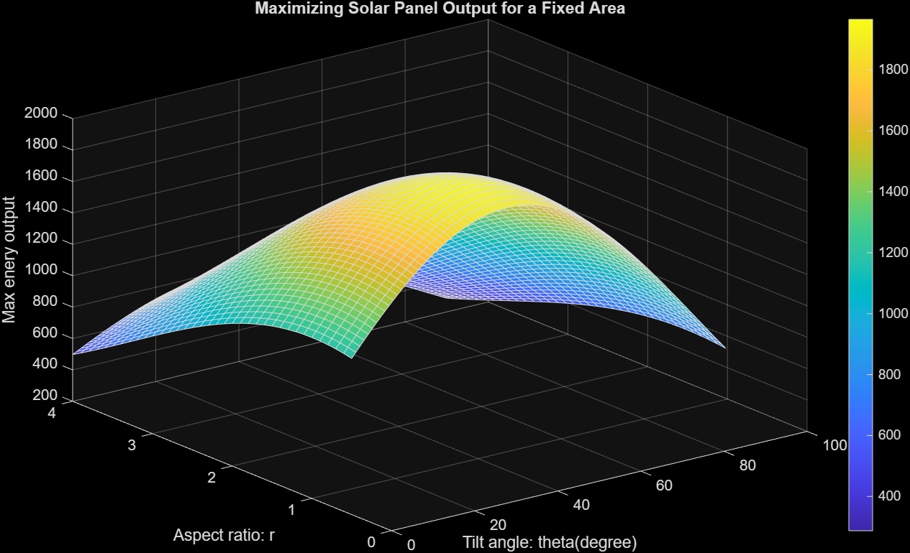

# mathworks-challenge
🔡 Mathworks Workplace Challenge | Maximizing Solar Panel Output for a Fixed Area | SolarPanel4

## Objective

This project uses MATLAB optimization techniques to determine the optimal tilt angle and aspect ratio of a solar panel with a fixed area to maximize modeled energy output.

The optimization variables are:
- Fixed panel area (A): 2 m²
- Tilt angle (theta): 0° to 90°
- Aspect ratio (r): 0.5 to 4

## Method

The modeled energy output was calculated using three components:
- Tilt efficiency as a function of panel angle
- Sunlight intensity as a function of panel angle
- Shape efficiency as a function of aspect ratio

These factors were combined with the fixed panel area of 2 m² to define the objective function.

MATLAB's Optimization Toolbox was then used to determine the tilt angle and aspect ratio that maximize the modeled output.

A 3D surface plot was generated using:
- meshgrid()
- surf()

## Results

The optimized design was:

- Optimal tilt angle: 37.5°
- Optimal aspect ratio: 1.0
- Maximum energy output: 1965.926 simplified arbitrary units

The results indicate that the best panel shape for the fixed area is a square panel.

## Figure

## Requirements

- MATLAB R2026a or compatible version
- Optimization Toolbox (Required)

## How to Run

1. Install MATLAB.
2. Install the **Optimization Toolbox** if it is not already installed.
3. Open `SolarPanel.mlx` in MATLAB.
4. Run the Live Script from the beginning.
5. MATLAB will calculate the optimal tilt angle and aspect ratio and generate the 3D surface plot.

## Limitations

This project uses a simplified mathematical model and does not account for many real-world operating conditions that affect solar-panel performance.

Some limitations include:

- Geographic location and latitude are not considered.
- Time of day and seasonal changes in the Sun's position are not modeled.
- Weather conditions such as cloud cover are not included.
- Shading from nearby panels, buildings, trees, or other obstructions is not considered.
- Panel temperature and its effect on efficiency are not modeled.
- Dust and other surface contamination are not included.
- Inverter efficiency and the losses involved in converting DC power to AC power are not considered.
- Wiring and other electrical system losses are not included.
- The shape-efficiency factor (`fr`) is a simplified geometric approximation rather than a relationship based on measured physical, environmental, or material behavior.
- The calculated output is reported in simplified arbitrary units rather than a real-world measurement such as solar irradiance in W/m².
- The optimization result depends entirely on the equations, assumptions, variable ranges, and constraints defined in the model.

## Future Improvements

The model could be improved by incorporating real-world solar and environmental data for a specific installation location.

Possible improvements include:

- Use measured or historical solar irradiance and weather data.
- Include geographic location, time of day, and seasonal Sun-position changes.
- Add panel azimuth so both the tilt angle and the direction the panel faces can be optimized.
- Model temperature effects on solar-cell efficiency.
- Include inverter efficiency, wiring losses, and other installation-related losses.
- Account for shading from surrounding objects or neighboring panels.
- Include initial **light-induced degradation (LID)** when a panel is first exposed to sunlight.
- Include long-term annual degradation, aging, and dust accumulation.
- Run the optimization from several different starting points to verify that the same optimal tilt angle and aspect ratio are consistently found.
- Compare the model's predictions with measured data from existing solar installations.
- Build a physical prototype and compare measured output with the MATLAB model.
